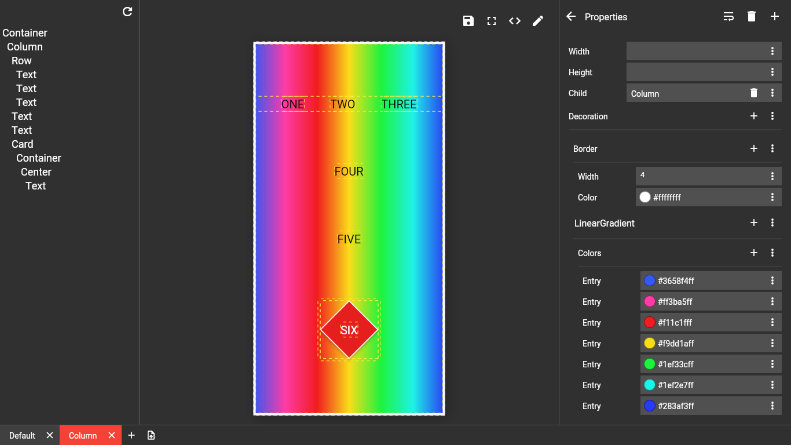

# Prototype

Prototyping Software for flutter developed in flutter

### Live Demo

[Prototype here](https://dhaval15.github.io/prototype.io)
This version will have some bugs, for full experience build on desktop.

### Folder Structure

- **feather** : Main Application.
- **parsers** : Package for providing parsing facility.
- **fountain** : Package which works like Dart Streams, for delivering updates with functionality to run code on separate isolate.
- **lambda** : Package for providing updates based on formulas like KLWP.
- **box** : Wrapper around `lambda` for with better composition and type support.
- **select** : Package to support editing functionality.
- **flutter_box** : This package includes box versions of flutter widgets and components.
- **builder** : It is a utility for generating a box version of flutter component.
- **extras** : Some extra utilities.
- **file_utils** : This package wraps file utilities which support both web and native.

### Features

- [x] Live Preview
- [x] Code View
- [ ] Tree View
- [ ] Lambda Integration
- [ ] Keyboard Only Mode
- [ ] Drag and Drop Support
- [ ] Workspace Support

### Screenshots

